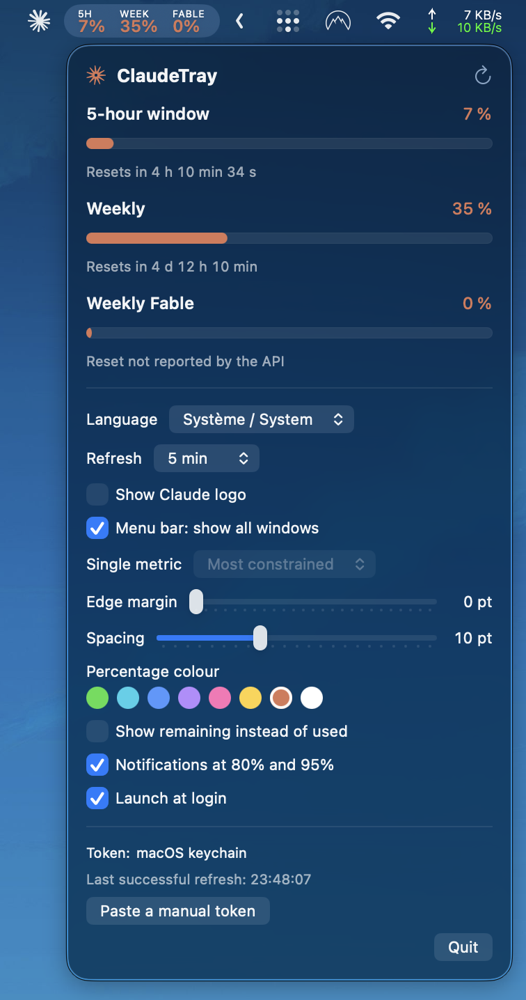

# ClaudeTray

Your Claude usage, in the macOS menu bar. Time left before the reset, percentage used on the rolling
5-hour window, on the weekly window, and on every per-model quota — without opening a terminal.


Native SwiftUI app, macOS 14+, **zero dependencies**, a single outbound connection, no telemetry.

> Independent project, not affiliated with Anthropic. It relies on an undocumented endpoint — the one
> behind the `/usage` command in Claude Code — and may stop working without notice.

## Requirement: Claude Code installed and logged in

ClaudeTray has no account of its own. It reads the OAuth token written by **Claude Code**, the
command-line client. Without it, the app has no data source and will show "Aucun token trouvé"
(no token found).

The Claude desktop app is not a substitute: it only stores an Electron encryption key
(`Claude Safe Storage`) in the keychain, which is useless here.

```bash
npm install -g @anthropic-ai/claude-code   # or the official installer
claude                                     # then /login
```

**Installing is not enough — logging in is what writes the token.** Once logged in, you don't have to
use Claude Code; it simply refreshes the token whenever it runs. If you never launch it, the keychain
token eventually expires: use a long-lived token instead, `claude setup-token` issues one valid for a
year, to be pasted into ClaudeTray.

Tested on a Max subscription. Behaviour on other plans has not been verified.

## Installing

1. Download the `.dmg` from the [Releases](../../releases) page.
2. Open it and drag **ClaudeTray** into **Applications**.
3. Launch it. The app has no Dock icon: it appears in the menu bar, top right.
4. macOS asks for keychain access — that is the app reading Claude Code's token. Pick
   **Always Allow** so you are not asked again.

The app is Developer ID signed and notarized by Apple: no Gatekeeper warning, nothing special to do
on first launch.

To uninstall: **Quitter** in the popover, then delete `/Applications/ClaudeTray.app` and the
`~/Library/Application Support/ClaudeTray` folder.

## Using it



Click the menu bar indicator to open the popover: one progress bar per quota window, each with its
percentage and a countdown to its reset.

Percentages turn **orange at 80%** and **red at 95%**, in the menu bar and in the popover alike. A
local notification fires at both thresholds, once per window, re-armed at the next reset.

### Settings, all in the popover

| Setting | Effect |
| --- | --- |
| Language | System, English, French, German, Spanish, Italian |
| Refresh rate | Auto, 1 min, 5 min, 15 min, 30 min, 1 h |
| Claude logo | Shown or hidden in the menu bar |
| Windows shown | All side by side, or a single metric |
| Single metric | 5-hour window, weekly, or whichever is most constrained |
| Used / remaining | Flips the displayed value |
| Colour | Eight swatches for percentages below the alert thresholds |
| Spacing | Gap between elements, 2 to 24 pt |
| Edge margin | Left and right margin, 0 to 24 pt |
| Notifications | Alerts at 80% and 95%, toggleable |
| Launch at login | Through `SMAppService` |

In **Auto** mode the app polls every 90 s while the 5-hour window is in use, every 7 min otherwise.
Countdowns animate locally, once a second, and cost no request at all. Polling is suspended on sleep
and on a locked session, and resumes on wake.

### Languages

The interface ships in **English, French, German, Spanish and Italian**. By default it follows your
macOS language, falling back to English when none of the five matches. You can also force one from
the popover — the change applies immediately, no restart.

### Columns

`5H` and `WEEK` come from the two main windows. Extra columns — `FABLE`, `OPUS`… — are the per-model
quotas, named as the API names them. Nothing is hardcoded: a column appears if the account has that
quota and disappears otherwise. No empty rows are left behind.

## Troubleshooting

| What you see | Cause | Fix |
| --- | --- | --- |
| "No token found" | Claude Code missing, or never logged in | Run `claude` then `/login`, or paste a token from `claude setup-token` |
| "401 — token rejected or expired" | Expired token, Claude Code idle for a long time | Run `claude` once, or use a `setup-token` token |
| "429 — too many requests" | API polled too often | Nothing to do: the app backs off on its own, up to 30 min between attempts |
| "Unexpected response format" | The undocumented endpoint changed shape | Open an issue; the last valid data stays on screen |
| "Data stale for X" | No successful call for 15 min | Hit the refresh button, or check your network |
| The keychain dialog keeps coming back | Unsigned build, compiled locally | Choose **Always Allow**, or paste a manual token |
| Nothing in the menu bar | Menu bar is full | Quit another item, or reduce the spacing in the settings |

The popover footer always shows which token source is in use, the time of the last successful
refresh, and the current error message if there is one.

## Security and privacy

- **One outbound connection**, over HTTPS, to `api.anthropic.com`. No telemetry, no third-party
  service, no external dependency: Apple frameworks only.
- **No logging.** The token is never printed, never written to a log, never included in displayed
  error messages.
- **The token is never held in memory** between calls: it is re-read on every request, because the
  keychain one expires after about an hour.
- **A manual token is stored in clear text on disk**, at `~/Library/Application Support/ClaudeTray/token`,
  mode `0600` inside a `0700` folder. The file is created with those restrictive permissions before
  anything is written to it, and permissions are tightened again on read if they have drifted. If you
  would rather write nothing to disk, leave that field empty: the keychain then stays the only source.
- **Sandbox disabled**, out of necessity: reading the keychain and `~/.claude` is impossible
  otherwise. The hardened runtime is enabled and no signing exception is requested.
- **No auto-update**: the app never downloads or executes code.

Token resolution order, on every call:

1. `~/Library/Application Support/ClaudeTray/token` — the token pasted into the app
2. macOS keychain, service `Claude Code-credentials`
3. `~/.claude/.credentials.json`, or `$CLAUDE_CONFIG_DIR/.credentials.json`

## Building from source

Xcode 15+, macOS 14+. The `.xcodeproj` is generated by
[XcodeGen](https://github.com/yonaskolb/XcodeGen) from `project.yml`, but it is committed: opening the
project requires no extra tooling.

```bash
git clone https://github.com/ClawClawOne/ClaudeTray.git
cd ClaudeTray
open ClaudeTray.xcodeproj      # then ⌘R
```

Under **Signing & Capabilities**, tick *Automatically manage signing* and pick your team. Without a
team the signature stays ad-hoc and macOS will ask for keychain access again after every rebuild —
the manual token field in the popover is the way out.

After editing `project.yml`:

```bash
xcodegen generate
xcodebuild -project ClaudeTray.xcodeproj -scheme ClaudeTray -configuration Debug build
```

The project builds with zero warnings, and should stay that way.

### Producing a signed, notarized DMG

```bash
./scripts/make-dmg.sh
```

The script builds Release, signs with your *Developer ID Application* certificate, builds the DMG,
submits it to Apple for notarization, staples the ticket and verifies everything with `spctl`. Two
one-time prerequisites: a Developer ID certificate in your keychain, and notarization credentials
stored under a named profile.

```bash
xcrun notarytool store-credentials claudetray \
  --apple-id "you@example.com" --team-id "XXXXXXXXXX" --password "app-specific-password"
```

The password is an *app-specific password* created on appleid.apple.com. For a local dry run without
notarization: `SKIP_NOTARIZE=1 ./scripts/make-dmg.sh`.

## Under the hood

Data source, the same one `/usage` uses in Claude Code:

```
GET https://api.anthropic.com/api/oauth/usage
Authorization: Bearer <access_token>
anthropic-beta: oauth-2025-04-20
```

The `anthropic-beta` header is mandatory: without it the API returns 401. This is not a
pay-as-you-go API key — `ANTHROPIC_API_KEY` appears nowhere in the code and would not work here.

Because the endpoint is undocumented, the app is written to fail cleanly: it keeps the last valid
snapshot on screen, names precisely what went wrong (401, 429, unexpected schema, network) and marks
the data as stale past 15 minutes. It never invents a reset date: only `resets_at` is displayed, or
"not reported by the API".

If the API changes, here is where to look:

| Symptom | File |
| --- | --- |
| Persistent 401 with a valid token | `UsageAPIClient.betaHeader` — the beta header value changed |
| "Unexpected response format" | `Models/UsageModels.swift`, `RawUsageResponse` / `RawLimit` |
| Percentages ×100 or ÷100 | `Utilization.normalize` — the only place that decides the scale |
| Reset date not decoded | `UsageAPIClient.decodeISODate` |
| Recurring 429s | `activeInterval` / `idleInterval` / `maxBackoff` in `UsageStore.swift` |

Code layout:

```
ClaudeTray/
├── ClaudeTrayApp.swift          MenuBarExtra, .window style
├── Models/UsageModels.swift     decoding, normalization, displayable snapshot
├── Services/
│   ├── TokenResolver.swift      the three token sources, in order
│   ├── UsageAPIClient.swift     the single network call, errors, ISO dates
│   ├── UsageStore.swift         observable state, cadence, backoff, sleep
│   ├── NotificationManager.swift  80% / 95% thresholds
│   └── LaunchAtLogin.swift      SMAppService
├── Support/                     persisted settings, colours, translations
└── Views/                       menu bar, popover, formatting
```

Two workarounds are worth knowing before touching the UI: `MenuBarExtra` will not render a two-line
view (so the label is rasterized through `ImageRenderer`), and a `ColorPicker` is unusable inside a
menu bar popover (it opens `NSColorPanel`, which dismisses the popover). `CLAUDE.md` covers these
traps in detail.

## Author

Built by **[TheUnnamedCompany](https://theunnamedcompany.com)**.
Questions, feedback: [contact@theunnamedcompany.com](mailto:contact@theunnamedcompany.com), or open an
issue on this repository.

ClaudeTray is free and MIT licensed. If it saves you a few `/usage` runs a day, you can
[buy me a coffee](https://buymeacoffee.com/theunnamedcompany) — entirely optional, and it changes
nothing about the app.

## License

MIT — see [LICENSE](LICENSE). Copyright © 2026 TheUnnamedCompany.
